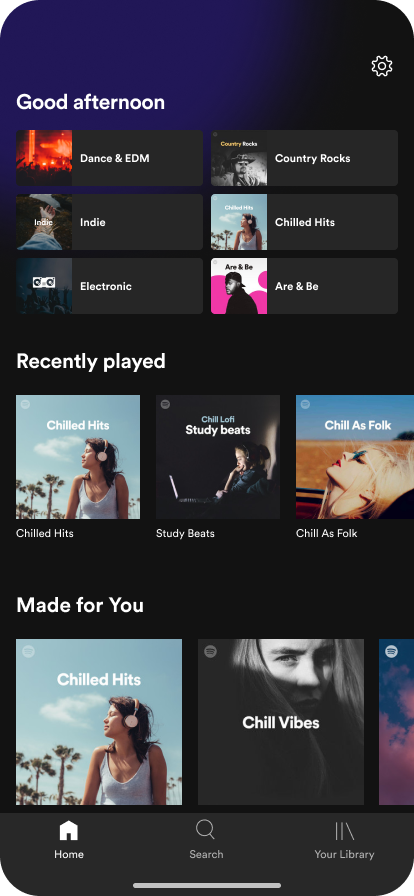

# Spotify
### This app is written in Typescipt and SCSS

## Features

- No libraries used
- Custom routing
- Caches downloaded songs in indexedDB and downloads songs once
- Mark songs as liked
- Albums list
- Album page
- Player
  - play/pause/next/prev
  - shuffle
- Search by (Albums, Artists, Song Names)
- Artist Page (same as Album)
